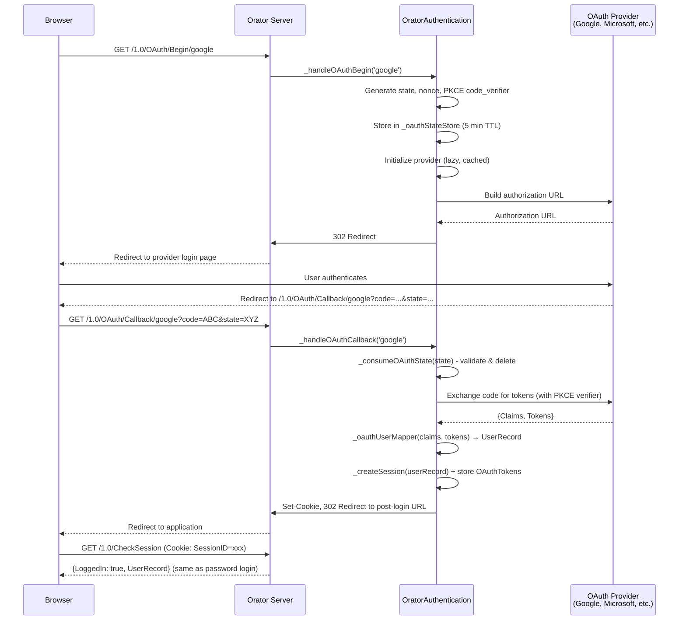

# Architecture

## System Design

Orator Authentication follows the Fable service provider pattern. It registers as a service type with Fable's service manager and orchestrates session management, route registration, and optional OAuth flows through the Orator API server.

```
Fable (Core)
  ├── Orator (API Server Orchestration)
  │     └── Service Server (Restify or IPC)
  │           ├── Authentication Routes (Authenticate, CheckSession, Deauthenticate)
  │           └── OAuth Routes (Providers, Begin, Callback) [optional]
  └── OratorAuthentication (This Module)
        ├── Session Store (in-memory Map)
        ├── Pluggable Authenticator (username/password)
        ├── OAuth Provider Registry (OIDC / MSAL)
        ├── OAuth State Store (CSRF protection)
        └── OAuth User Mapper (claims → user record)
```

## Session Lifecycle

```mermaid
sequenceDiagram
    participant Client
    participant Server as Orator Server
    participant Auth as OratorAuthentication
    participant Store as Session Store

    Client->>Server: POST /1.0/Authenticate {UserName, Password}
    Server->>Auth: _handleAuthentication()
    Auth->>Auth: Check denied passwords
    Auth->>Auth: Call _authenticator(username, password)
    Auth->>Store: _createSession(userRecord)
    Store-->>Auth: Session {SessionID, UserRecord, CreatedAt}
    Auth->>Server: Set-Cookie: SessionID=xxx; HttpOnly
    Server-->>Client: {LoggedIn: true, SessionID, UserRecord}

    Client->>Server: GET /1.0/CheckSession (Cookie: SessionID=xxx)
    Server->>Auth: getSessionForRequest(request)
    Auth->>Store: sessionStore.get(sessionID)
    Store-->>Auth: Session object
    Auth->>Auth: Check TTL, update LastAccess
    Server-->>Client: {LoggedIn: true, UserRecord}

    Client->>Server: GET /1.0/Deauthenticate (Cookie: SessionID=xxx)
    Server->>Auth: _handleDeauthentication()
    Auth->>Store: _destroySession(sessionID)
    Auth->>Server: Clear cookie (Expires: epoch)
    Server-->>Client: {LoggedIn: false}
```

## OAuth Authorization Code Flow

When OAuth providers are configured, the module implements the standard OAuth 2.0 Authorization Code Flow with PKCE:



## Component Architecture

### Provider Abstraction

Both OAuth provider backends implement the same three-method interface, allowing the main module to treat them identically:

| Method | Purpose |
|--------|---------|
| `async initialize()` | Discover endpoints / create client |
| `async buildAuthorizationURL(state, nonce, codeVerifier)` | Build the redirect URL |
| `async handleCallback(callbackURL, state, nonce, codeVerifier)` | Exchange code for tokens, return `{ Claims, Tokens }` |

### Provider Types

| Type | Library | Use Case |
|------|---------|----------|
| `openid-connect` | `openid-client` v6 | Any standard OIDC provider (Google, Okta, Auth0, Azure AD) |
| `msal` | `@azure/msal-node` | Microsoft-specific: Exchange Online, Graph API, Azure AD B2C |

### State Store

The OAuth state store provides CSRF protection for the authorization flow:

- **State Parameter** - UUID generated per flow, stored with metadata
- **One-Time Use** - Consumed on callback, preventing replay attacks
- **TTL** - 5-minute default, configurable via `OAuthStateTTL`
- **Auto-Cleanup** - Background interval (60s) purges expired entries
- **Process-Safe** - Cleanup interval uses `.unref()` so it won't prevent process exit

### Session Store

The session store is an in-memory `Map` keyed by session ID:

- **Session ID** - UUID generated by Fable's distributed UUID generator
- **TTL** - 24-hour default, configurable via `SessionTTL`
- **Last Access** - Updated on every `CheckSession` call
- **OAuth Tokens** - Stored on the session for OAuth logins (not exposed via `CheckSession`)

## Security Considerations

1. **HttpOnly Cookies** - Enabled by default; session tokens are not accessible to client-side JavaScript
2. **PKCE** - All OAuth flows use S256 PKCE code challenge, preventing authorization code interception
3. **State Parameter** - Generated per-flow UUID with 5-minute TTL prevents CSRF attacks
4. **Nonce** - Generated per-flow UUID prevents token replay attacks
5. **One-Time State** - State is consumed on use; replaying a callback URL fails
6. **Denied Passwords** - Configurable block list checked before the authenticator is invoked
7. **No Token Leakage** - `CheckSession` never exposes OAuth tokens to the client
8. **Secure Cookies** - Optional `CookieSecure` flag for HTTPS-only deployments
